# 🛍️ Catalog — Flutter Product Explorer App

A modern Flutter e-commerce product explorer app built as part of an internship assignment. Consumes the [DummyJSON](https://dummyjson.com/products) REST API to display, search, filter, and manage products with a clean UI and smooth animations.

---

## 📱 Download APK

> **[⬇️ Download Latest APK](https://github.com/provikash/catalog/raw/main/Tools/apk/app-release.apk)**

---


---

## 📁 Assignment Structure

```
catalog/
├── lib/                  # Part 1 — Flutter Product Explorer App
├── Part 2/               # Part 2 solution
├── Part 3/               # Part 3 solution
└── Tools/
    ├── apk/              # Release APK
    └── screenshots/      # App screenshots
```


## ✨ Features

| Feature | Details |
|---|---|
| 🏠 Product Listing | Grid layout with image, title, price, discount badge |
| 🔍 Search | Real-time search with 350ms debounce |
| 🎛️ Filter | Category filter + price range slider |
| 📄 Pagination | Infinite scroll — loads 20 products at a time |
| 📦 Product Detail | Full details with image carousel, reviews, shipping info |
| ❤️ Wishlist | Add/remove with persistent local storage |
| 💾 Offline Cache | Products cached via SharedPreferences |
| 💫 Animations | Hero image, heart bounce, floating heart |
| 🌙 Dark Mode | Full light/dark theme support |
| ⚡ Loading States | Skeletonizer loading effect |
| ⚠️ Error Handling | Retry button on network failure |

---

## 📸 Screenshots

| | | |
|---|---|---|
| 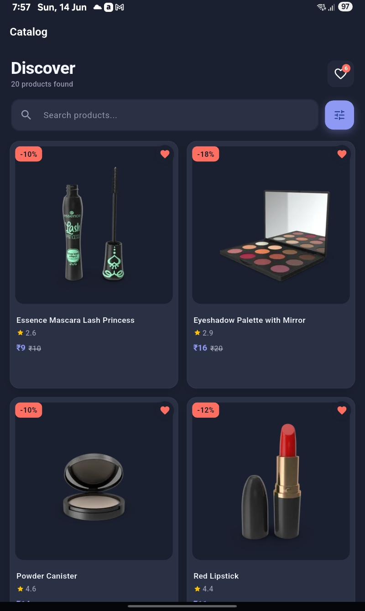 | 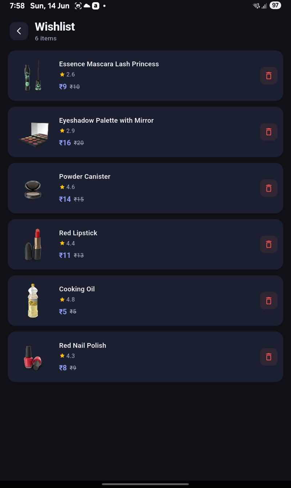 | 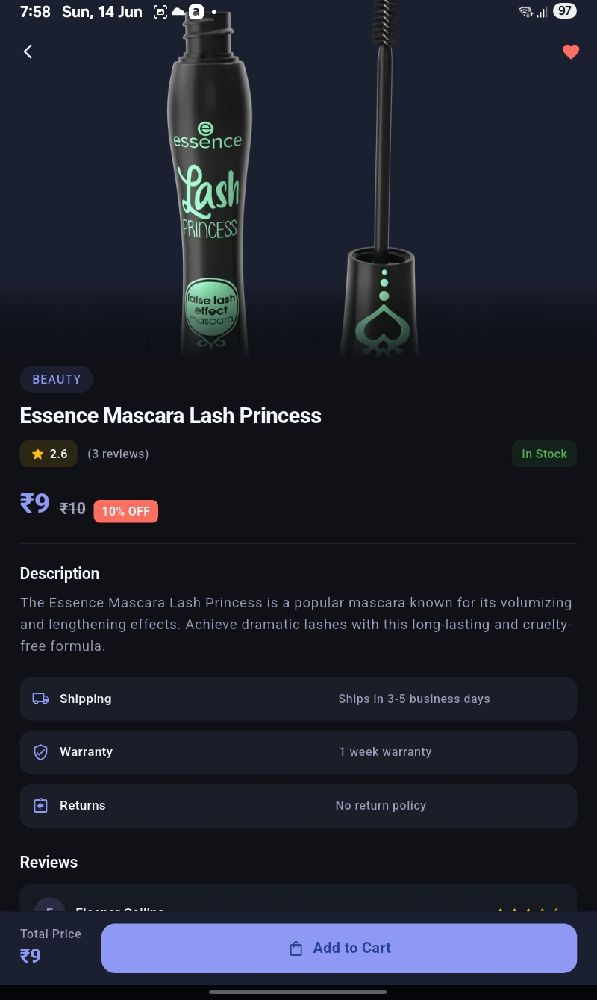 |
| 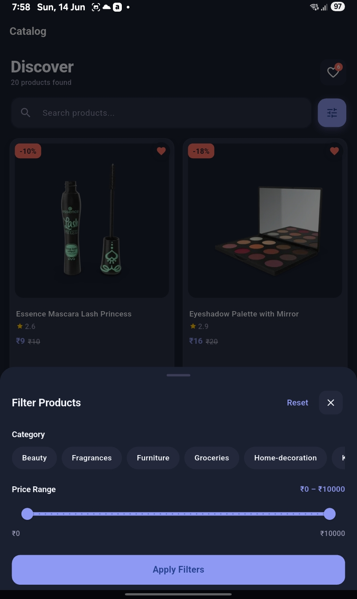 | 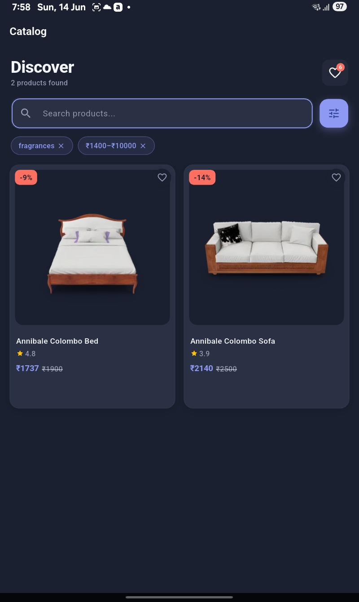 | 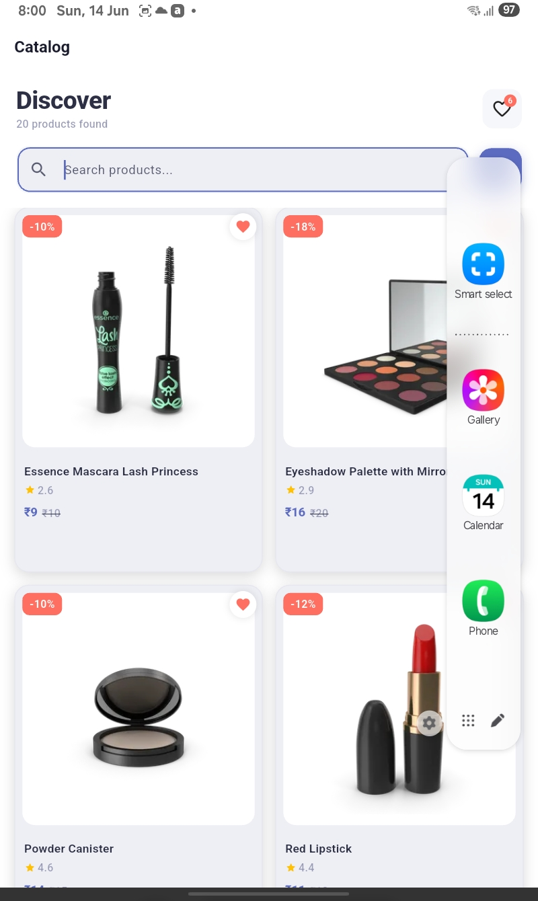 |
| 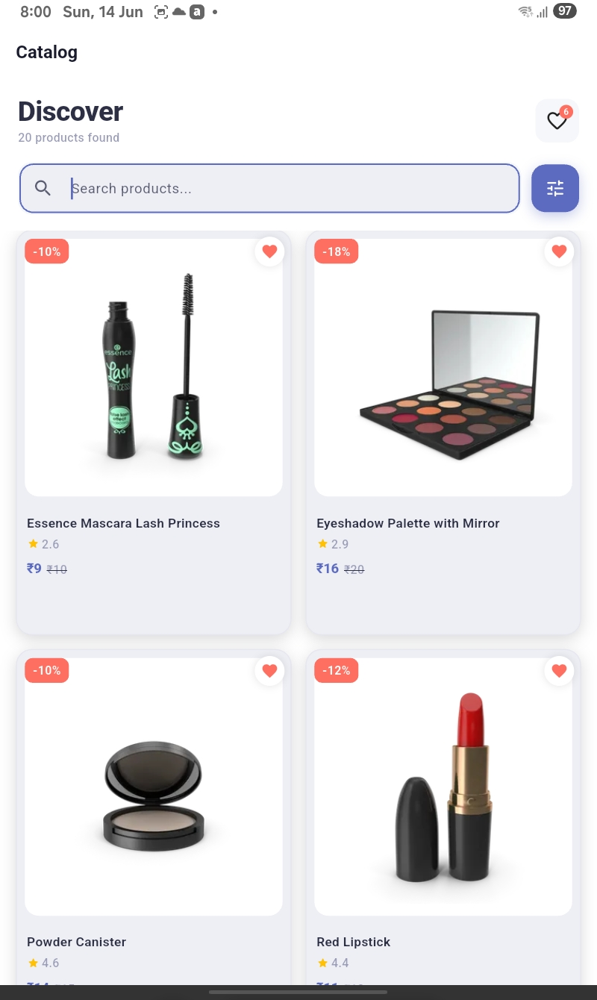 | 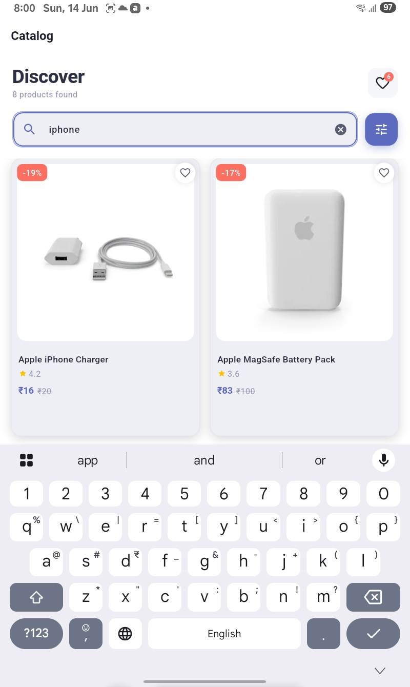 | 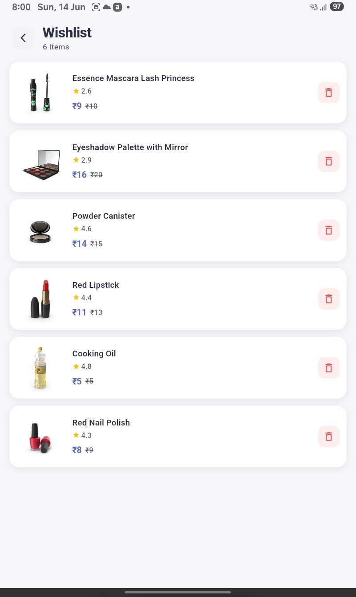 |
| 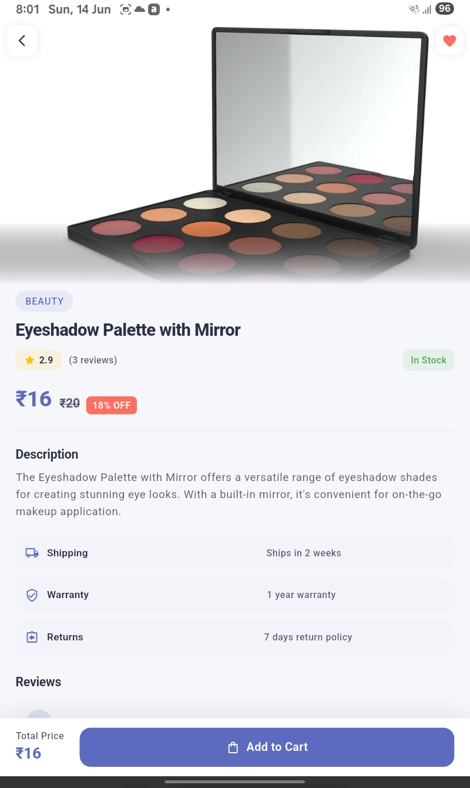 | 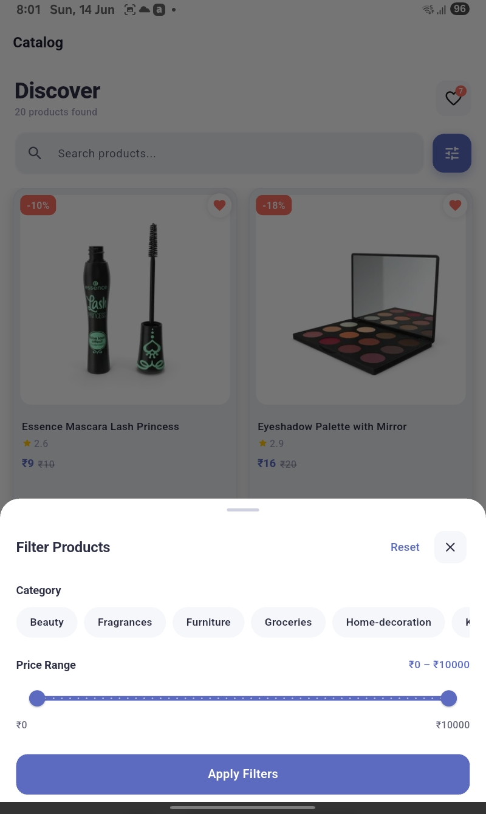 | 

---

## 🏗️ Architecture — MVC Pattern

```
View  (UI Widgets / Screens)
  ↓
Controller  (Riverpod Notifier — business logic + state)
  ↓
Service  (API Service — network calls)
  ↓
API  (dummyjson.com REST API)
```

### Folder Structure

```
lib/
├── controllers/
│   ├── product_notifier.dart     # Riverpod Notifier — all business logic
│   └── product_state.dart        # Immutable state class
│
├── models/
│   ├── product_models.dart       # Product data model + fromJson/toJson
│   ├── product_response.dart     # API response wrapper
│   ├── category_model.dart       # Category model
│   └── review_model.dart         # Review model
│
├── services/
│   └── api_service.dart          # All API calls + offline cache logic
│
├── core/
│   ├── constants/
│   │   └── api_constants.dart    # Base URL + endpoint constants
│   ├── dio_client.dart           # Singleton Dio instance with interceptors
│   └── themes/
│       └── theme.dart            # AppColors, AppTextStyles, AppTheme
│
└── views/
    └── screens/
        ├── product_list/
        │   ├── product_list_screen.dart
        │   └── widgets/
        │       ├── product_card.dart
        │       ├── search_bar.dart
        │       ├── filter_bottom_sheet.dart
        │       ├── product_grid.dart
        │       ├── filter_chip.dart
        │       ├── empty_view.dart
        │       └── error_view.dart
        ├── product_detail/
        │   ├── product_detail_screen.dart
        │   └── widgets/
        │       ├── add_to_cart_bar.dart
        │       ├── info_row.dart
        │       └── review_card.dart
        └── wishlist/
            └── wishlist_screen.dart

Tools/
├── apk/
│   └── app-release.apk           # Latest release build
└── screenshots/
    └── 1.jpg … 12.jpg            # App screenshots
```

---

## 🛠️ Tech Stack

| Category | Technology |
|---|---|
| Framework | Flutter 3.x + Dart |
| State Management | Riverpod (NotifierProvider) |
| Networking | Dio |
| Local Storage | SharedPreferences |
| Image Caching | cached_network_image |
| Loading Effect | Skeletonizer |
| Architecture | MVC |

---

## 📦 Dependencies

```yaml
dependencies:
  flutter_riverpod: ^2.6.1      # State management
  dio: ^5.7.0                   # HTTP client
  cached_network_image: ^3.4.1  # Image caching
  shared_preferences: ^2.3.2    # Local storage
  skeletonizer: ^2.1.3          # Skeleton loading UI
  shimmer: ^3.0.0               # Shimmer effect
```

---

## 🚀 Setup & Run

### Prerequisites
- Flutter SDK `>=3.0.0`
- Dart SDK `>=3.0.0`
- Android Studio / VS Code
- Android Emulator or Physical Device

### Steps

```bash
# 1. Clone the repository
git clone https://github.com/provikash/catalog.git

# 2. Navigate to project
cd catalog

# 3. Install dependencies
flutter pub get

# 4. Run the app
flutter run
```

### Build APK

```bash
# Release APK
flutter build apk --release

# APK location
build/app/outputs/flutter-apk/app-release.apk
```

---

## 🌐 API Reference

Base URL: `https://dummyjson.com`

| Endpoint | Description |
|---|---|
| `GET /products?limit=20&skip=0` | Paginated product list |
| `GET /products/search?q=phone` | Search products |
| `GET /products/categories` | All categories |
| `GET /products/category/{slug}` | Products by category |
| `GET /products/{id}` | Single product detail |

---

## 💡 Key Implementation Details

### Debounced Search
```dart
// 350ms delay — prevents API call on every keystroke
Timer(const Duration(milliseconds: 350), () => _executeSearch(query));
```

### Infinite Scroll Pagination
```dart
// Triggers 300px before reaching bottom
if (pixels >= maxExtent - 300) loadMore();
```

### Offline Cache
```dart
// Save on success
prefs.setString('products_$skip', jsonEncode(response.data));

// Load on network failure
final cached = prefs.getString('products_$skip');
if (cached != null) return ProductResponse.fromJson(jsonDecode(cached));
```

### Wishlist Persistence
```dart
// Converts full product to JSON → saves to SharedPreferences
// Reloads automatically on app start via build() in NotifierProvider
```

### Hero Animation
```dart
// Same tag on list card and detail screen → Flutter animates automatically
Hero(tag: 'product-image-${product.id}', child: CachedNetworkImage(...))
```

### Heart Bounce + Floating Heart
```dart
// Bounce: scale 1.0 → 1.5 → 0.85 → 1.0
// Float: heart rises and fades away on wishlist tap
TweenSequence<double>([...]).animate(_heartController);
```


---

## 👨‍💻 Developer

**Vikash**
- GitHub: [@provikash](https://github.com/provikash)
- Built for Flutter Internship Assignment

---

## 📄 License

This project is for internship evaluation purposes.
